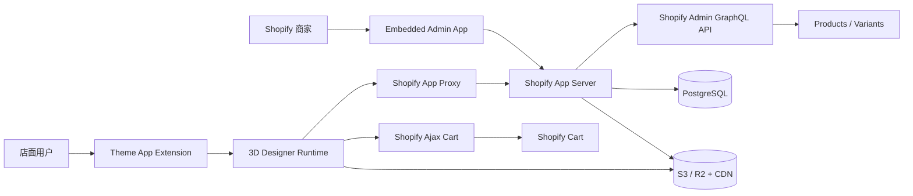

# 3D Backyard Designer 阶段总结与 Shopify App 实施路线

文档版本：0.1  
更新日期：2026-09-29  
适用范围：当前 `backyard-3d-demo` 原型到可安装、可运营的 Shopify App MVP

## 1. 执行摘要

当前项目已经完成了产品体验层面的技术验证：用户可以设置后院尺寸、在 3D 场景中添加商品、拖拽移动、旋转、复制、删除，并获得越界、重叠和占地反馈。商品清单、方案保存、分享链接、购物车 Payload，以及本地创建商品和上传 GLB 的流程也已经跑通。

但当前项目仍然是一个单机前端 Demo，不是 Shopify App。它还没有 Shopify 安装授权、多店铺隔离、真实商品同步、线上文件存储、店面嵌入、服务端计划存储、Webhook 和生产部署能力。

下一阶段不应继续优先优化建模细节。最重要的目标是先完成一个端到端 Shopify 闭环：

1. 商家能够把 App 安装到开发店铺。
2. App 能够读取真实 Shopify Product 和 Variant。
3. 店面用户能够从真实商品库进入 3D Designer。
4. Designer 能够把真实 Variant 批量加入 Shopify Cart。
5. 方案能够保存、恢复和分享。
6. 模型文件先允许使用占位模型或少量测试 GLB，完整模型生产管线放在闭环之后。

推荐的下一个里程碑名称是：**Live Shopify Catalog MVP**。完成标准不是模型多精细，而是“真实商品进入设计器并能真实加购”。

## 2. 当前阶段成果

### 2.1 已完成的用户能力

- 输入后院宽度和长度，按真实比例生成 Yard。
- 3D 后院环境、房屋、围栏、地面、平台和绿化。
- 商品库搜索和分类。
- 商品按钮添加与桌面端拖入 Yard。
- 鼠标直接拖拽移动商品。
- 拖拽旋转、快捷旋转、复制和删除。
- 基于真实宽度和深度的边界判断。
- 商品间矩形占地重叠判断。
- 占地面积、占用率和布局问题反馈。
- 商品清单、数量、价格合计和 Shopify Cart Payload 预览。
- 方案本地保存、撤销、重做和链接分享。
- 基础移动端布局。

### 2.2 已完成的 GLB 验证能力

- 本地创建自定义商品。
- 输入名称、SKU、分类、价格和真实尺寸。
- 上传 GLB 2.0 文件。
- 文件大小、外部资源、三角面和材质数量检查。
- 自动居中、Y 轴朝向、底部落地和尺寸校准。
- GLB 异步加载和解析缓存。
- IndexedDB 持久化商品与模型。
- 刷新后恢复商品、模型和方案引用。
- 本地商品删除及相关场景实例清理。

### 2.3 当前技术栈

- Vite
- TypeScript
- Three.js
- Lucide Icons
- IndexedDB / Local Storage
- Playwright Core QA

### 2.4 当前关键限制

- 没有 Shopify App 安装和 OAuth 流程。
- 没有 App Bridge、Polaris 管理后台或 Shopify Session Token 验证。
- 商品数据来自 `src/catalog.ts`，不是真实 Shopify 数据。
- Product ID 和 Variant ID 主要是模拟值。
- GLB 只保存在当前浏览器，其他设备和用户无法访问。
- 方案只保存在浏览器或 URL Hash，没有服务端数据库。
- 分享链接依赖同一套本地商品数据，无法跨设备完整恢复自定义模型。
- 没有多店铺数据隔离。
- 没有 Product 更新、删除或 App 卸载 Webhook。
- 没有生产环境日志、监控、备份和错误追踪。
- 没有真实店面 Theme App Extension。
- 购物车目前只展示 Payload，没有执行真实线上加购。

## 3. 阶段性结论

当前 Demo 的价值是验证 3D Designer 的交互和数据结构，而不是作为最终 Shopify 应用直接发布。

可以保留的核心资产：

- Three.js 场景初始化和渲染逻辑。
- Yard 尺寸和相机逻辑。
- 商品放置、选择、移动和旋转逻辑。
- `src/spatial.ts` 中的空间计算。
- 方案序列化结构。
- GLB 加载、校准和缓存思路。
- 现有 Shopify 风格店面 UI。
- 浏览器 QA 脚本和响应式测试方式。

需要替换或重构的部分：

- `src/catalog.ts` 的静态商品数组要替换为 Shopify Catalog Provider。
- `src/model-assets.ts` 的 IndexedDB 存储要替换为后端数据库和对象存储。
- `src/main.ts` 需要拆分为设计器内核、UI、数据适配器和 Shopify 集成层。
- Local Storage 方案仓库要替换为服务端 Plan Repository。
- 模拟 Cart Payload 要替换为真实 Shopify Ajax Cart 请求。

## 4. 推荐的 Shopify 产品形态

首期建议使用以下组合：

- **分发方式**：先采用单店铺或指定客户店铺的 Custom Distribution，不立即申请 Shopify App Store 公共上架。
- **管理端**：Embedded Shopify App，供商家同步商品、绑定模型和管理方案。
- **店面入口**：Theme App Extension，提供 App Block 或 App Embed，向主题加入“3D Backyard Designer”入口。
- **设计器页面**：通过店铺同域下的 App Proxy 路径进入，例如 `/apps/backyard-designer`。
- **真实加购**：在 Online Store 场景使用 Shopify Ajax Cart API `/cart/add.js`。
- **服务端**：Shopify 官方 React Router App 模板，Node.js + TypeScript。
- **数据库**：开发环境可使用 SQLite，生产环境使用 PostgreSQL。
- **模型存储**：S3 或 Cloudflare R2，前置 CDN；数据库只保存模型元数据和 URL。
- **计划存储**：PostgreSQL 保存方案，公开分享使用不可猜测的 Share Token。

这个组合能让店面设计器与 Shopify Cart 保持同域关系，同时把 Admin API Token、模型管理和方案存储留在安全的服务端。

## 5. 目标系统架构



### 5.1 管理端职责

- 安装与授权 App。
- 读取 Shopify Products 和 Variants。
- 搜索或选择要进入设计器的商品。
- 为 Product 或 Variant 绑定模型和真实尺寸。
- 查看模型处理状态。
- 启用或停用商品。
- 查看用户保存的 Backyard Plans。
- 配置加购或询价模式。

### 5.2 店面端职责

- 获取当前店铺可用的设计器商品目录。
- 加载经过发布的模型 URL。
- 完成后院尺寸、布局和空间反馈。
- 保存或恢复方案。
- 生成分享链接。
- 把 Variant ID 和数量提交到 Shopify Cart。
- 在需要时进入询价流程。

### 5.3 服务端职责

- Shopify OAuth、Session Token 和店铺会话管理。
- Admin GraphQL API 调用。
- App Proxy 请求签名验证。
- 多店铺数据隔离。
- Product / Variant 数据同步。
- 模型上传签名和元数据管理。
- Plan CRUD、分享权限和版本控制。
- Webhook 处理。
- 审计日志、错误记录和限流。

## 6. 推荐仓库结构

当前仓库不建议继续把所有功能放在一个 `src/main.ts`。迁移后建议采用 npm workspaces：

```text
3D-BackYard/
  apps/
    shopify-app/
      app/
        routes/
        services/
        db/
      prisma/
      shopify.app.toml
  packages/
    designer-core/
      src/
        scene/
        placement/
        spatial/
        models/
        plans/
    designer-ui/
      src/
        catalog/
        toolbar/
        summary/
        dialogs/
    contracts/
      src/
        catalog.ts
        plans.ts
        models.ts
  extensions/
    backyard-designer-theme/
  docs/
  legacy-demo/
```

推荐先把当前项目保留为 `legacy-demo` 或单独分支，在新结构稳定前不要直接删除可工作的 Demo。

## 7. 当前代码到新架构的映射

### `src/spatial.ts`

处理方式：直接迁入 `packages/designer-core/src/spatial/`。

原因：它是纯计算模块，不依赖 DOM、Shopify 或 Three.js 场景生命周期，最适合优先保留并补充单元测试。

### `src/catalog.ts`

处理方式：保留 TypeScript 商品契约，删除硬编码商品数组和最终生产模型构建函数。

未来来源：

- 管理端通过 Admin GraphQL API 同步 Product / Variant。
- 店面端通过 App Proxy 获取经过筛选的 Designer Catalog。
- SKU 只作为展示和搜索字段，稳定关联必须使用 Shopify GID 和 Variant GID。

### `src/model-assets.ts`

处理方式：拆成运行时模型加载器和服务端模型仓库。

保留：

- GLTFLoader。
- Meshopt 解码。
- 模型实例缓存。
- 尺寸校准、中心点和落地处理。
- 模型复杂度统计。

替换：

- IndexedDB Blob 改为 CDN URL。
- 本地商品表改为 PostgreSQL。
- 浏览器上传改为服务端签发的 Presigned Upload URL。

### `src/main.ts`

处理方式：按职责拆分，避免继续扩张单文件。

建议拆成：

- `DesignerApp`：初始化和生命周期。
- `SceneRenderer`：Three.js 场景、相机和渲染。
- `PlacementController`：选择、拖拽、旋转和复制。
- `CatalogProvider`：商品数据来源接口。
- `ModelProvider`：模型加载接口。
- `PlanRepository`：保存和加载方案接口。
- `CartAdapter`：Shopify Ajax Cart 适配器。

### `src/style.css`

处理方式：拆成设计器 UI 样式和管理端样式。

- 店面设计器继续使用当前低干扰布局。
- Embedded Admin App 使用 Shopify Polaris Web Components 或官方推荐管理端组件。
- 不要把 Polaris 样式直接加载到店面设计器，避免污染主题样式。

## 8. 先定义四个稳定接口

在接入 Shopify 前，建议先把当前本地实现隐藏在四个接口后面：

```ts
export interface CatalogProvider {
  listProducts(): Promise<DesignerProduct[]>;
  getProduct(id: string): Promise<DesignerProduct | null>;
}

export interface ModelProvider {
  loadModel(asset: ModelAsset): Promise<THREE.Group>;
}

export interface PlanRepository {
  save(plan: BackyardPlan): Promise<SavedPlan>;
  load(id: string): Promise<BackyardPlan | null>;
}

export interface CartAdapter {
  addLines(lines: CartLine[]): Promise<void>;
}
```

第一阶段仍可以使用：

- `LocalCatalogProvider`
- `IndexedDbModelProvider`
- `LocalPlanRepository`
- `PreviewCartAdapter`

接入 Shopify 时再替换为：

- `ShopifyCatalogProvider`
- `CdnModelProvider`
- `RemotePlanRepository`
- `ShopifyAjaxCartAdapter`

这样能够降低迁移风险，并让现有 Demo 始终保持可运行。

## 9. 核心数据模型

### Shop

- `id`
- `shopDomain`
- `accessTokenEncrypted`
- `installationStatus`
- `currencyCode`
- `settingsJson`
- `installedAt`
- `uninstalledAt`

### ProductModel

- `id`
- `shopId`
- `shopifyProductGid`
- `shopifyVariantGid`，允许为空
- `sku`
- `widthM`
- `depthM`
- `heightM`
- `activeVersionId`
- `status`
- `createdAt`
- `updatedAt`

### ModelVersion

- `id`
- `productModelId`
- `version`
- `originalFileKey`
- `optimizedFileKey`
- `thumbnailUrl`
- `fileSize`
- `triangleCount`
- `materialCount`
- `yawDegrees`
- `groundOffsetM`
- `processingStatus`
- `processingError`

### BackyardPlan

- `id`
- `shopId`
- `customerId`，允许为空
- `shareTokenHash`
- `name`
- `schemaVersion`
- `yardWidthM`
- `yardDepthM`
- `currencyCode`
- `status`
- `createdAt`
- `updatedAt`

### PlanItem

- `id`
- `planId`
- `shopifyProductGid`
- `shopifyVariantGid`
- `modelVersionId`
- `quantityGroupKey`
- `positionX`
- `positionZ`
- `rotationY`

重要原则：价格、库存和可售状态在加购时重新从 Shopify 获取，不能永久相信方案保存时的旧值。

## 10. 方案数据契约

建议把当前方案升级为显式版本化的数据结构：

```ts
interface BackyardPlanV2 {
  schemaVersion: 2;
  shop: string;
  yard: {
    widthM: number;
    depthM: number;
  };
  placements: Array<{
    instanceId: string;
    productGid: string;
    variantGid: string;
    modelVersion: number;
    x: number;
    z: number;
    rotationY: number;
  }>;
}
```

规则：

- 坐标统一使用米。
- 角度内部统一使用弧度。
- 每个方案必须带 `schemaVersion`。
- 不把模型 Blob、纹理或商品完整对象写进方案。
- 分享链接只包含方案 ID 和分享 Token，不把完整方案塞进 URL Hash。
- 加载旧方案时必须经过迁移函数。

## 11. 服务端接口建议

### 管理端接口

- `GET /api/admin/products`：读取可绑定的 Shopify 商品和 Variant。
- `GET /api/admin/product-models`：读取已经绑定的模型。
- `POST /api/admin/models/presign`：获取模型直传地址。
- `POST /api/admin/models/complete`：完成上传并创建处理任务。
- `PATCH /api/admin/product-models/:id`：修改尺寸、方向和发布状态。
- `DELETE /api/admin/product-models/:id`：取消商品模型绑定。

### 店面 App Proxy 接口

- `GET /apps/backyard-designer/api/catalog`：返回当前店铺可用商品和模型。
- `POST /apps/backyard-designer/api/plans`：创建方案。
- `GET /apps/backyard-designer/api/plans/:id`：读取方案。
- `PATCH /apps/backyard-designer/api/plans/:id`：继续编辑方案。
- `POST /apps/backyard-designer/api/plans/:id/share`：创建分享 Token。
- `POST /apps/backyard-designer/api/quotes`：提交询价。

### 购物车

Online Store 内直接调用：

```http
POST /cart/add.js
Content-Type: application/json
```

请求体：

```json
{
  "items": [
    {
      "id": 1234567890,
      "quantity": 2,
      "properties": {
        "_backyard_plan_id": "plan_xxx"
      }
    }
  ]
}
```

注意：Ajax Cart 使用数字 Variant ID，而 Admin GraphQL 通常返回 GID。服务端商品契约需要同时提供两者，或在店面返回前完成转换。

## 12. Shopify 权限与安全边界

### 初始权限

MVP 优先申请最少权限：

- `read_products`

仅在确定功能需要时再增加：

- 写 Product Metafield 时增加相应产品写权限。
- 使用 Shopify Files 时增加文件相关权限。
- 使用 Metaobjects 时增加相应 Metaobject 权限。

如果模型和绑定关系完全保存在 App 数据库与对象存储中，首期不需要为了模型功能申请大量 Shopify 写权限。

### 必须遵守的安全规则

- Admin API Access Token 只能存在服务端。
- 店面 JavaScript 不得直接调用 Admin GraphQL API。
- Embedded Admin 请求必须验证 Shopify Session Token。
- App Proxy 请求必须验证 Shopify 签名参数。
- 所有数据库查询必须带 `shopId` 条件，禁止跨店铺读取。
- 模型上传使用短时效 Presigned URL。
- 上传完成后必须由服务端验证文件类型、大小和最终对象 Key。
- 分享 Token 必须不可预测，数据库中优先存 Hash。
- 删除店铺或卸载 App 后按保留策略清理数据。
- 日志不得记录 Access Token、Session Token 或完整客户隐私数据。

## 13. Webhook 计划

首期至少处理：

- App 卸载：停用店铺并撤销后台任务。
- Product 更新：刷新标题、SKU、Variant、图片和可售状态。
- Product 删除：停用对应 ProductModel，不直接破坏历史 Plan。

如果走公开 App 分发，还需要按照 Shopify 要求实现适用的隐私与合规 Webhook。

Webhook 处理必须：

- 验证 HMAC。
- 快速返回成功响应。
- 把耗时同步工作放入队列。
- 使用 Webhook ID 或业务键实现幂等。

## 14. 分阶段实施计划

时间只是单个熟悉 TypeScript 和 Shopify 的全栈开发者参考值，不包括模型制作、客户审批和 App Store 审核。

### 阶段 0：冻结契约并拆分现有 Demo

参考工期：3-5 个工作日。

工作内容：

- 为 Product、ModelAsset、Plan、CartLine 建立独立类型契约。
- 把空间计算迁移为无 UI 依赖的核心模块。
- 引入 CatalogProvider、ModelProvider、PlanRepository 和 CartAdapter。
- 把 `main.ts` 拆成场景、交互、UI 和数据适配器。
- 保持 Local Adapter 完整可运行。
- 为方案序列化、空间判断和商品分组增加单元测试。

完成标准：

- 当前 Demo 行为不变。
- 替换数据来源不需要修改 Three.js 场景逻辑。
- `npm run build` 和浏览器 QA 通过。

### 阶段 1：建立 Shopify App 基础

参考工期：4-7 个工作日。

工作内容：

- 准备 Shopify Partner / Dev Dashboard 和 Development Store。
- 使用 Shopify CLI 创建 React Router App。
- 配置 Custom Distribution 测试安装。
- 接入 Shopify OAuth、会话存储和 Session Token 验证。
- 配置 PostgreSQL 和数据库迁移。
- 实现 Shop 表和 App 卸载 Webhook。
- 部署一个可公开访问的 HTTPS Preview 环境。

完成标准：

- App 可以从 Shopify Admin 安装和打开。
- 重新打开 Admin 后会话仍然有效。
- 不同测试店铺的数据完全隔离。
- 卸载后店铺状态会被正确更新。

### 阶段 2：接入真实 Shopify 商品

参考工期：5-8 个工作日。

工作内容：

- 通过 Admin GraphQL API 获取 Product、Variant、SKU、价格、图片和可售状态。
- 在 Embedded Admin 中使用 Shopify Resource Picker 选择商品。
- 建立 ProductModel 绑定记录。
- 初期允许所有商品使用统一占位模型。
- 处理 Product 更新和删除 Webhook。
- 店面 Catalog API 返回真实 Product 和 Variant。

完成标准：

- 管理端可以选择真实商品加入 Designer Catalog。
- Designer 中展示的 SKU、价格和 Variant 来自 Shopify。
- Product 更新后能在合理时间内同步。

### 阶段 3：店面嵌入和真实加购

参考工期：7-10 个工作日。

工作内容：

- 创建 Theme App Extension。
- 提供 App Block 或 App Embed 入口。
- 配置 App Proxy 路径。
- 把 Designer Runtime 接入真实 Catalog API。
- 使用数字 Variant ID 调用 `/cart/add.js`。
- 在加购前重新确认商品存在且可售。
- 处理部分商品失败和库存变化。

完成标准：

- 商家无需编辑主题代码即可启用入口。
- 店面用户可以打开完整 Designer。
- 多件商品能够一次加入真实 Shopify Cart。
- Line Item Properties 中能关联 Backyard Plan ID。

### 阶段 4：方案保存、继续编辑和分享

参考工期：5-8 个工作日。

工作内容：

- 实现 Plan Repository 和数据库表。
- 支持 Guest Plan 和登录客户 Plan。
- 自动保存采用防抖和版本号。
- 创建不可猜测的分享链接。
- 加载方案时处理已删除、下架或模型升级的商品。
- 增加询价提交接口和后台查看入口。

完成标准：

- 用户可跨设备打开分享方案。
- 分享者不能修改原方案，除非明确授权。
- 下架商品不会导致整个方案无法打开。

### 阶段 5：模型云端管线

参考工期：模型数量和源文件质量决定，不与 Shopify 闭环阻塞。

工作内容：

- 对象存储直传。
- 后台验证和异步处理队列。
- glTF Transform 清理、去重和 Meshopt 压缩。
- 纹理压缩和缩略图生成。
- 版本发布与回滚。
- 模型质量报告。
- 批量导入首批真实商品。

完成标准：

- 模型上传不占用 App Web 进程。
- 失败模型有明确错误原因。
- 已发布方案仍能引用正确模型版本。

### 阶段 6：生产加固

参考工期：5-8 个工作日。

工作内容：

- 日志、错误追踪和性能监控。
- 数据库备份和恢复演练。
- CDN、缓存策略和失效机制。
- API 限流和上传配额。
- WebGL 兼容性与低性能降级。
- 桌面端和主流移动设备验收。
- 隐私政策、数据删除和支持流程。

完成标准：

- 核心流程有自动化测试。
- 生产告警和回滚流程可用。
- 一台低端移动设备也能完成基础布局与加购。

## 15. 建议的第一轮 Sprint

第一轮 Sprint 只做 Shopify 基础和真实 Catalog，不做模型生产优化。

按顺序执行：

1. 确定分发方式：单客户 Custom Distribution。
2. 准备 Development Store 和 App 创建权限。
3. 确定部署平台、PostgreSQL 和对象存储供应商。
4. 使用 Shopify CLI 创建 React Router App。
5. 安装到 Development Store，跑通认证和 Admin 首页。
6. 创建 Shop 数据表和卸载 Webhook。
7. 用 Admin GraphQL API 拉取前 20 个真实 Product / Variant。
8. 在管理端完成商品选择和启用状态。
9. 为店面提供只读 Catalog JSON。
10. 让现有 Designer 用真实 Catalog JSON 替换 `src/catalog.ts`。
11. 使用占位模型显示真实商品。
12. 使用 `/cart/add.js` 完成一个真实 Variant 的加购。

Sprint 验收演示：商家安装 App，选择一个真实商品；消费者进入 Designer，添加该商品，然后在 Shopify Cart 中看到正确 Variant。

## 16. 环境变量建议

```text
SHOPIFY_API_KEY=
SHOPIFY_API_SECRET=
SHOPIFY_SCOPES=read_products
SHOPIFY_APP_URL=
DATABASE_URL=
SESSION_SECRET=
PLAN_SIGNING_SECRET=
OBJECT_STORAGE_ENDPOINT=
OBJECT_STORAGE_BUCKET=
OBJECT_STORAGE_ACCESS_KEY=
OBJECT_STORAGE_SECRET_KEY=
CDN_BASE_URL=
```

规则：

- 所有真实密钥只放部署平台 Secret Manager。
- 仓库只提交 `.env.example`。
- 开发、预发布和生产使用不同数据库和 Bucket。
- 不复用 Shopify API Secret 作为业务签名密钥。

## 17. MVP 验收清单

### 商家端

- App 可以安装、卸载和重新打开。
- 能看到当前店铺真实商品与 Variant。
- 能启用或停用 Designer 商品。
- 能为商品填写真实尺寸。
- 能绑定一个测试 GLB 或占位模型。
- Product 更新和删除可以同步。

### 店面端

- Theme Editor 可以启用 Designer 入口。
- Desktop 和 Mobile 可以打开 Designer。
- 商品数据来自当前店铺，而不是硬编码数组。
- 商品可以选择、拖动、旋转、复制和删除。
- 空间边界和重叠提示工作正常。
- 方案可以保存、恢复和分享。
- 多个 Variant 可以加入真实 Cart。

### 运维端

- 每条数据都关联 `shopId`。
- App 卸载 Webhook 可用。
- 错误有请求 ID 和结构化日志。
- 数据库有自动备份。
- 模型文件使用 CDN，不从 App 服务器同步转发。
- 未授权店铺无法访问管理接口。

## 18. 主要风险和应对

### Theme 兼容性

风险：不同 Shopify Theme 的 DOM、容器宽度和样式不同。

应对：Theme Extension 只负责入口，完整 Designer 尽量运行在独立全屏路径；所有 CSS 使用明确作用域。

### Product 与 Variant 绑定错误

风险：只使用 SKU 关联会因 SKU 修改或重复而失效。

应对：内部使用 Product GID 和 Variant GID，SKU 只用于展示和搜索。

### 价格和库存过期

风险：方案保存后价格或库存发生变化。

应对：方案保存布局，不承诺旧价格；加购前以 Shopify 当前 Variant 状态为准。

### 模型性能

风险：100 个源 GLB 质量不一致，移动端出现显存和加载问题。

应对：Shopify 闭环阶段只接少量代表模型；后续强制资产预算、压缩、版本和审核状态。

### 分享权限

风险：公开 Plan ID 被枚举或修改。

应对：读取使用随机 Share Token；编辑使用独立 Owner Token 或登录客户授权。

### App Proxy 缓存

风险：Catalog 更新后店面继续读取旧数据。

应对：Catalog 返回 ETag 或短时缓存，发布模型时主动更新版本号和资源 URL。

## 19. 当前不应该做的事情

- 不要在 Shopify 安装和真实加购完成前制作全部 100 个正式模型。
- 不要让浏览器直接持有 Admin API Token。
- 不要把 GLB Blob 存进 Product Metafield 或 PostgreSQL。
- 不要只用 SKU 作为商品主键。
- 不要把 Local Storage 当作正式方案数据库。
- 不要一开始同时支持 Online Store、Headless 和多个 Commerce 平台。
- 不要在首期加入复杂物理引擎、AR、自动设计 AI 或多人协作。
- 不要在 `src/main.ts` 中继续堆叠 Shopify 网络和数据库逻辑。

## 20. 需要尽快确认的业务决策

开始阶段 1 前需要确认：

1. 首期只服务一个客户店铺，还是计划公开上架 App Store？
2. Designer 使用独立全屏页面，还是嵌入现有 Collection / Product Page？
3. 用户不登录是否可以保存和分享方案？
4. 完成方案后默认加购，还是默认询价？
5. 模型绑定到 Product 还是 Variant？建议默认 Variant 优先，Product 允许作为回退。
6. 客户是否允许使用外部对象存储和 CDN？
7. 是否需要保存客户姓名、邮箱或地址？如果不需要，首期不要收集。
8. 谁负责维护商品真实尺寸，谁负责审核 GLB？

推荐默认答案：

- 单店铺 Custom Distribution。
- Theme Extension 提供入口，App Proxy 提供全屏 Designer。
- Guest Plan 使用分享 Token。
- 同时支持“加入购物车”和“提交询价”，店铺设置决定默认操作。
- Variant 级绑定优先。
- S3 / R2 + CDN。
- 首期不保存不必要的客户身份数据。

## 21. 官方参考资料

- Shopify App 脚手架：<https://shopify.dev/docs/apps/build/scaffold-app>
- Shopify App 分发：<https://shopify.dev/docs/apps/launch/distribution>
- Theme App Extensions：<https://shopify.dev/docs/apps/build/online-store/theme-app-extensions>
- App Proxy：<https://shopify.dev/docs/apps/build/online-store/app-proxies>
- Ajax Cart API：<https://shopify.dev/docs/api/ajax/reference/cart>
- Webhooks：<https://shopify.dev/docs/apps/build/webhooks>
- Shopify Admin GraphQL API：<https://shopify.dev/docs/api/admin-graphql>
- Shopify Metafields：<https://shopify.dev/docs/apps/build/custom-data/metafields>
- Shopify Metaobjects：<https://shopify.dev/docs/apps/build/custom-data/metaobjects>

## 22. 下一阶段完成定义

下一阶段不是“模型更真实”，而是以下闭环全部成立：

```text
安装 Shopify App
→ 读取真实 Product / Variant
→ 商家启用 Designer 商品
→ 店面打开 3D Designer
→ 使用真实商品完成布局
→ 保存或分享方案
→ 把真实 Variant 加入 Shopify Cart
```

达到这个完成定义后，再投入首批 100 个 GLB 的清理、优化、版本管理和批量发布，才能确保建模投入建立在稳定的商品与交易体系上。
